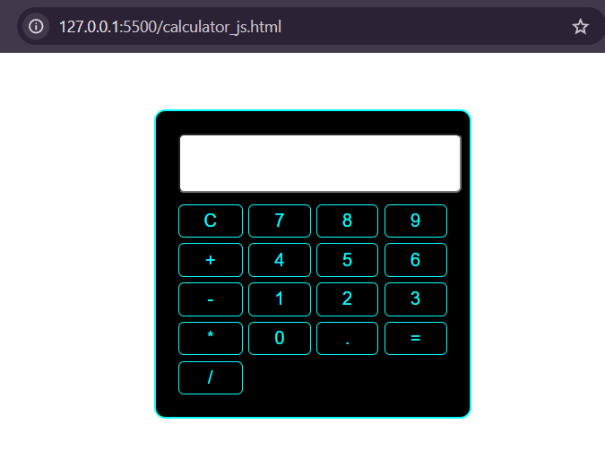
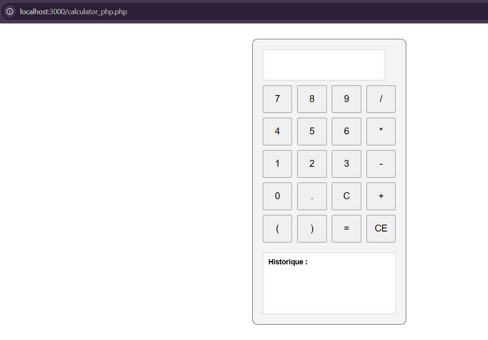

# Tests Unitaire - Calculatrice

## Introduction
Ce projet est une calculatrice interactive développée en JavaScript et PHP, avec des tests unitaires pour garantir la fiabilité des fonctionnalités. Il inclut une interface utilisateur graphique et un historique des calculs.

## Technologies utilisées
- **HTML/CSS** : Pour l'interface utilisateur.
- **JavaScript** : Pour la logique de calcul côté client.
- **PHP** : Pour la logique de calcul côté serveur avec gestion de session.
- **PHPUnit** : Pour les tests unitaires en PHP.
- **Jest** : Pour les tests unitaires en JavaScript.

## Structure du projet
```
calculator_js.html       # Interface utilisateur JavaScript
calculator_php.php       # Interface utilisateur PHP avec historique
calculator.css           # Styles CSS
calculator.js            # Logique de calcul JavaScript
calculator.php           # Logique de calcul PHP
composer.json            # Configuration des dépendances PHP
package.json             # Configuration des dépendances Node.js
tests/                   # Dossier contenant les tests unitaires
vendor/                  # Dépendances PHP installées
```

## Fonctionnalités
- **Calculatrice JavaScript** :
  - Opérations de base : addition, soustraction, multiplication, division.
  - Gestion des priorités avec les parenthèses.
  - Interface utilisateur interactive.

- **Calculatrice PHP** :
  - Historique des calculs.
  - Gestion des erreurs (division par zéro, expressions invalides).
  - Support des raccourcis clavier.

## Instructions d'installation
### Prérequis
- Node.js et npm
- PHP >= 8.0
- Composer

### Étapes
1. Clonez le dépôt :
   ```bash
   git clone https://github.com/YoussefGhollamallah/test-unitaire-calculatrice.git
   ```
2. Installez les dépendances PHP :
   ```bash
   composer install
   ```
3. Installez les dépendances Node.js :
   ```bash
   npm install
   ```
4. Lancez les tests unitaires :
   - Pour PHP :
     ```bash
     vendor/bin/phpunit tests/CalculatorTest.php
     ```
   - Pour JavaScript :
     ```bash
     npm test
     ```

## Tests unitaires
### JavaScript
Les tests JavaScript sont réalisés avec Jest. Exemple :
```javascript
test("addition", () => {
  expect(calculate("2+3")).toBe(5);
});
```

### PHP
Les tests PHP sont réalisés avec PHPUnit. Exemple :
```php
public function testAddition() {
    $this->assertEquals(5, $this->calc->calculate("2+3"));
}
```

## Captures d'écran
1. **Interface utilisateur JavaScript** :
   

2. **Interface utilisateur PHP avec historique** :
   

3. **Exécution des tests unitaires** :
   - JavaScript :
     
   - PHP :
     
